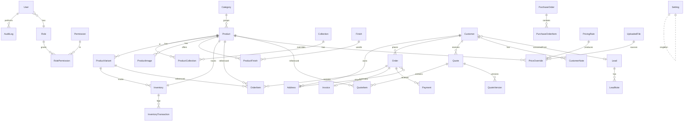

# Database ERD — Maison Vierkant India

Mermaid ERD (source of truth: `prisma/schema.prisma`, see `03-prisma-schema.prisma`).

## Entity notes
- **User / Role / Permission / RolePermission** — RBAC. `Role.key` ∈ {SUPER_ADMIN, ADMIN, SALES_MANAGER, SALES_EXECUTIVE, INVENTORY_MANAGER, CUSTOMER}. Many-to-many role↔permission.
- **Category** = series group (e.g. "U Series", "2025 Collection"). **Collection** = curated marketing grouping (many-to-many).
- **Product** = a series (id like `AU_Series`): name, slug, description, dims summary, base `eurPrice`, heroImage, status. **ProductVariant** = a model (`code`, `eurPrice`, `dims`, weight, volume).
- **ProductImage** (type: HERO|GALLERY|DRAWING, url, sort). **Finish / ProductFinish** — finish catalogue + per-product offered finishes + tier.
- **Inventory** (productId/variantId, warehouse, quantity, lowStockThreshold default 2) → **InventoryTransaction** (delta, reason, balanceAfter, actorId).
- **Customer / Address** (BILLING|SHIPPING) / **CustomerNote**. Customer may originate from **Lead**.
- **Order** (number `MVI-ORD-…`, status enum, subtotal/tax/transport/total, advanceAmount=50%, addresses) → **OrderItem** (productId, variantId, finish, qty, unitPriceInr, eurAtOrder, pricing snapshot) ; **Invoice** (number, pdfUrl) ; **Payment** (provider, status, amount, type=ADVANCE|BALANCE).
- **Quote** (number, status DRAFT|SENT|APPROVED|REJECTED|EXPIRED, billing/delivery addr, dealerMarkupPct, totals) → **QuoteItem** ; **QuoteVersion** (snapshot json, version#).
- **Lead** (source CATALOGUE|CONTACT|TRADE, name/email/phone/company/type, status pipeline) → **LeadNote**.
- **PurchaseOrder** (number, supplier=Atelier Vierkant, currency=EUR, status) → **PurchaseOrderItem**.
- **PricingRule** (versioned set: rate, discountPct, transportPct, packingFlat, dutyPct, gstPct, profitPct, dealerMarkupPct, isActive, formulaKey). **PriceOverride** (productId, eurPrice, sourceFileId). **UploadedFile** (kind PRICE_LIST|PRODUCT_SHEET|MEDIA, url, parseStatus, parsedJson).
- **Setting** — singleton key/value (company, tax, email, storage, fx defaults).
- **AuditLog** (actorId, action, entity, entityId, before json, after json, ip, createdAt).

## Key enums
`OrderStatus`(PENDING, CONFIRMED, SHIPPED, DELIVERED, CANCELLED) · `PaymentStatus`(PENDING, PAID, FAILED, REFUNDED) · `QuoteStatus` · `LeadStatus`(NEW, CONTACTED, QUALIFIED, WON, LOST) · `LeadSource` · `ImageType` · `FinishTier`(BASIC, STD, ENGOBE) · `InventoryReason`(PURCHASE, SALE, ADJUSTMENT, RETURN) · `FileKind` · `ParseStatus`(PENDING, PROCESSING, DONE, FAILED).
